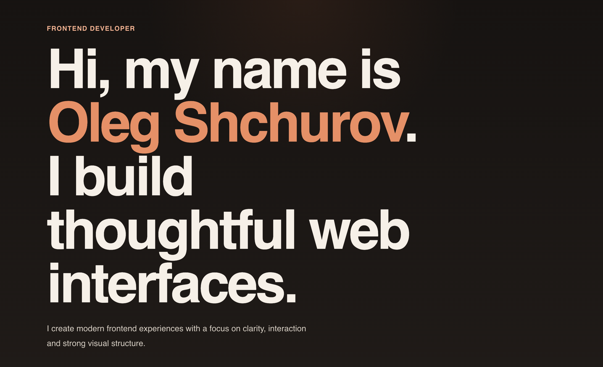

# 🧑‍💻 Personal Portfolio

An animated personal portfolio built with Vue 3 and Vite. The project presents my background as a frontend engineer, selected work, a downloadable CV and a small set of side projects that will grow over time.

🔗 Live: https://shchurofff-portfolio.vercel.app/
📄 CV: https://shchurofff-portfolio.vercel.app/cv.pdf

## Preview

<p align="center">
  
</p>

## ✨ Overview

The site is organized as a compact route-based experience:

- `Home` introduces the visual tone and overall focus.
- `About` summarizes my background, stack and working style.
- `Pet Projects` highlights the projects I am actively building.
- `Resume` provides a concise CV summary and a downloadable PDF.

Navigation is handled through route arrows, a keyboard shortcut driven navigation dialog and page transitions.

## 🧩 Features

- ⚡ Smooth page transitions and animations
- 🧱 Component-driven architecture (Vue 3 + Composition API)
- 🎯 Clean and readable layout system
- 📱 Fully responsive design
- 📄 Resume page with structured experience
- 🎨 Consistent design system (spacing, typography, tokens)

## 🛠 Tech Stack

- Framework: Vue 3 (Composition API)
- Build tool: Vite
- Language: TypeScript
- Styling: SCSS (design tokens + utility approach)
- Routing: Vue Router

## 🗂️ Project Structure

- `src/views` page-level route components
- `src/components` reusable UI and section components
- `src/data` typed content models for cards, projects, skills and resume data
- `src/types` shared TypeScript interfaces
- `src/assets/styles` global tokens, utilities and motion styles
- `public/cv.pdf` downloadable resume

## 🚀 Available Scripts

```sh
pnpm install
pnpm dev
pnpm build
pnpm lint
```

## 📄 Resume

The `Resume` page includes a downloadable `cv.pdf` and a concise summary of my current CV in the same visual language as the rest of the portfolio.

## 💡 Notes

This portfolio is intentionally selective. The projects page is built to grow gradually as more personal work becomes ready to show.
